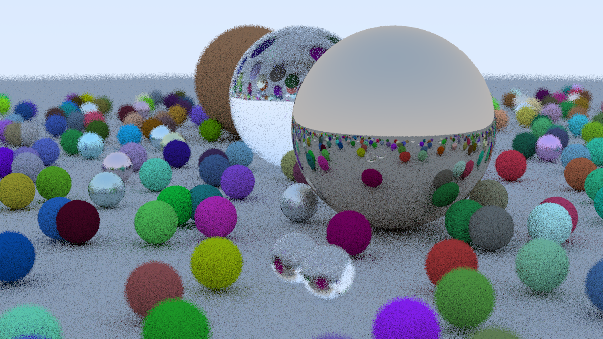

# Raytracing in One Weekend
Mostly following the [book](https://raytracing.github.io/books/RayTracingInOneWeekend.html) by Peter Shirley using whatever cursed amalgamation of modern C++ features I feel like.

Here's a low quality version of the final scene (and the cover of the book):

